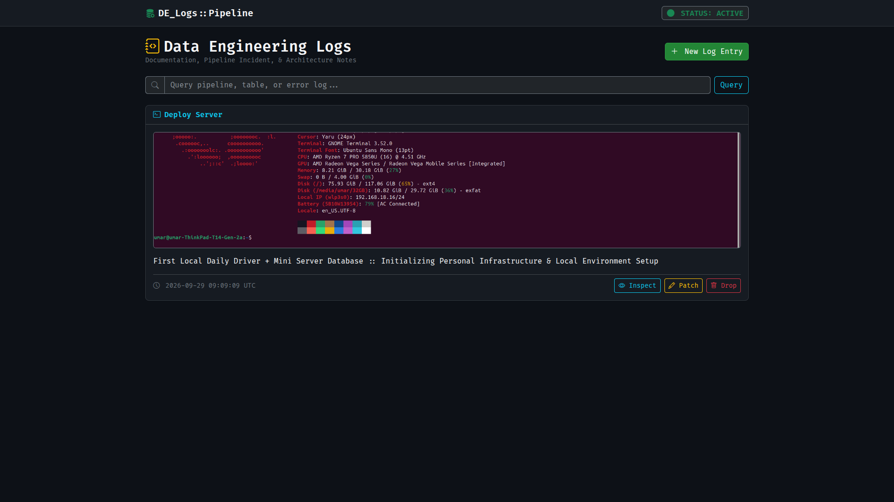
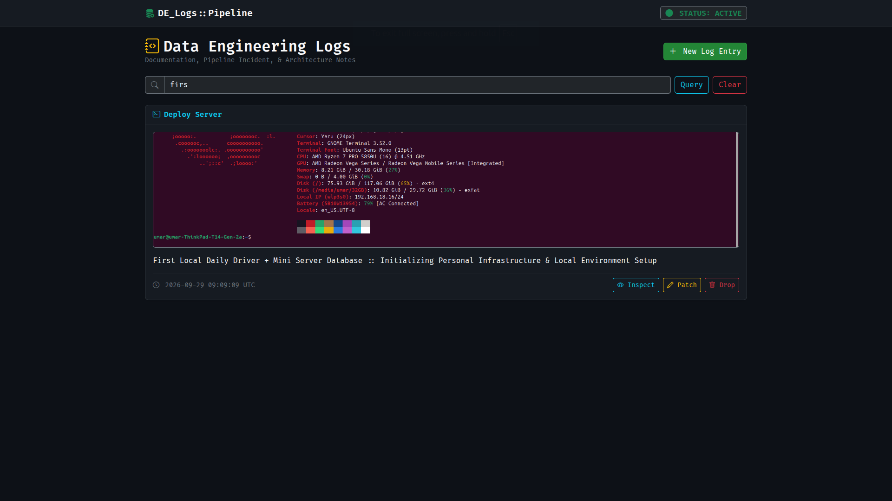
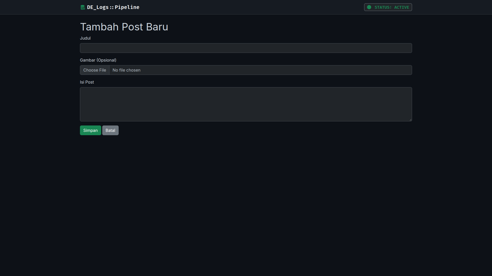
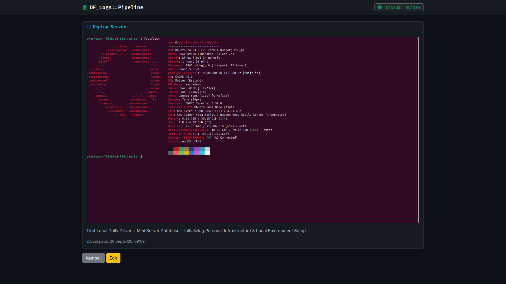
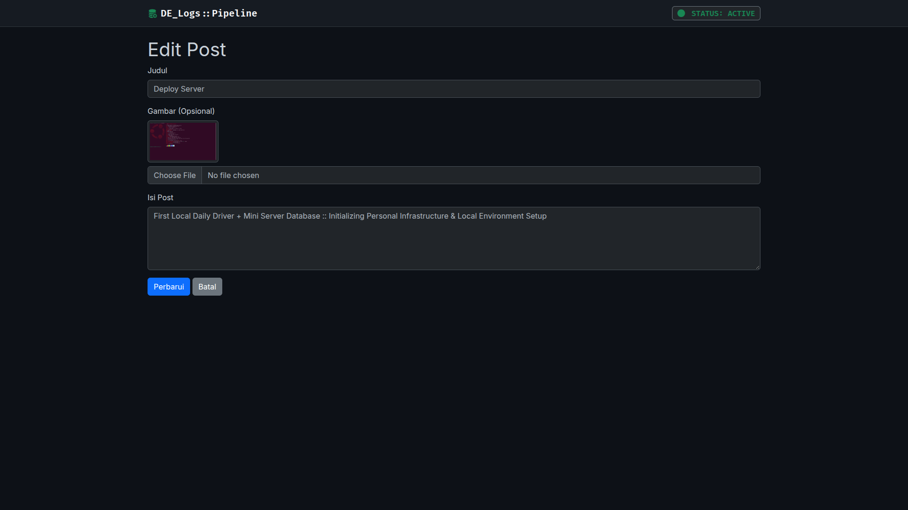

# 🛠️ DE_Logs :: Data Engineering Pipeline Logging System
> **Tugas Rutin 10 — Blog CRUD Laravel (Pemrograman Web)**  
> *Universitas Negeri Medan (UNIMED) — Semester Ganjil 2026/2027*

[](https://laravel.com)
[](https://php.net)
[](https://getbootstrap.com)
[](https://ubuntu.com)

---

## 📌 Ringkasan Proyek

**DE_Logs** adalah aplikasi manajemen log berbasis web yang dirancang khusus untuk mencatat dokumentasi arsitektur, insiden pipeline, serta *environment setup* dengan estetika **Data Engineering Dashboard / Observability Platform**.

Aplikasi ini dibangun menggunakan framework **Laravel** dengan arsitektur **MVC**, menerapkan validasi ketat, proteksi CSRF, *Blade Components*, *Route Model Binding*, serta fitur-fitur tingkat lanjut seperti *Soft Delete*, *Image Upload*, dan *Search Query*.

---

## 📋 Pemenuhan Requirements (Tugas Rutin 10)

| No | Persyaratan Tugas | Status | Detail Implementasi |
|---|---|---|---|
| 1 | `Route::resource('posts')` + Named Routes | ✅ **Selesai** | Menerapkan `Route::resource('posts', PostController::class)` di `routes/web.php`. |
| 2 | `PostController` Resource (7 Methods) | ✅ **Selesai** | Memiliki method `index`, `create`, `store`, `show`, `edit`, `update`, `destroy`. |
| 3 | Blade Layout Master (`@extends`/`@yield`) | ✅ **Selesai** | Menggunakan layout terpusat `resources/views/layouts/app.blade.php`. |
| 4 | Minimal 2 Components (`Alert`, `Card`) | ✅ **Selesai** | Dibuat via Artisan: `<x-alert>` dan `<x-card>` di `resources/views/components/`. |
| 5 | Validasi + Error per field + `old()` Input | ✅ **Selesai** | Menerapkan `$request->validate()` dan menampilkan pesan kesalahan bawaan. |
| 6 | Flash Message Sukses/Gagal | ✅ **Selesai** | Menggunakan `session('success')` yang terintegrasi langsung dengan `<x-alert>`. |
| 7 | `@csrf` pada Form + `@method` Spoofing | ✅ **Selesai** | Mengamankan seluruh form POST dengan `@csrf` serta spoofing `@method('PUT')` & `@method('DELETE')`. |
| 8 | Route Model Binding + Pagination | ✅ **Selesai** | Menggunakan implicit binding `Post $post` dan `paginate(5)` pada controller. |

### ⭐ Fitur Bonus Ditambahkan
- 🔍 **Search Query Filter**: Pencarian log berdasarkan judul dan isi teks secara presisi.
- 🗑️ **Soft Deletes**: Menggunakan trait `SoftDeletes` bawaan Eloquent agar data log terlindungi dari penghapusan permanen secara tidak sengaja.
- 🖼️ **Image Attachment Upload**: Mendukung unggahan gambar arsitektur/tangkapan layar sistem dengan penyimpanan terpisah di `storage/app/public`.

---

## 🖥️ Tangkapan Layar Aplikasi (Screenshots)

### 1. Dashboard Log Pipeline (Index)
Tampilan utama bergaya *Dark Observability Dashboard* lengkap dengan status indikator pipeline.


### 2. Pencarian Log / Search Query Filter
Filter data log berdasarkan kata kunci spesifik secara langsung.


### 3. Tambah Log Baru (Create & Upload)
Form penambahan log pipeline baru yang dilengkapi pengunggah berkas gambar.


### 4. Detail Log System (Inspect / Show)
Halaman inspeksi log untuk meninjau riwayat dan tangkapan layar sistem secara mendalam.


### 5. Patch Log System (Edit / Update)
Form pembaruan entri log dengan pengisian otomatis data terdahulu (*old input*).


---

## 🏗️ Arsitektur & Struktur Proyek

```text
TugasWeb-P10-BlogCRUD/
├── app/
│   ├── Http/
│   │   └── Controllers/
│   │       └── PostController.php      # Controller utama (7 method CRUD + search + upload)
│   └── Models/
│       └── Post.php                    # Model Eloquent (SoftDeletes & Mass Assignment)
├── database/
│   ├── migrations/
│   │   └── *_create_posts_table.php    # Skema tabel (title, body, image, deleted_at)
│   └── database.sqlite                 # Database SQLite lokal
├── public/
│   └── storage -> ...                  # Symlink berkas publik
├── resources/
│   └── views/
│       ├── components/
│       │   ├── alert.blade.php         # Blade Component Alert Notification
│       │   └── card.blade.php          # Blade Component Terminal Card Container
│       ├── layouts/
│       │   └── app.blade.php           # Master Layout (Dark Mode, Bootstrap 5)
│       └── posts/
│           ├── create.blade.php        # View Form Tambah Log
│           ├── edit.blade.php          # View Form Patch/Update Log
│           ├── index.blade.php         # View Utama Dashboard & List
│           └── show.blade.php          # View Detail Inspeksi Log
├── routes/
│   └── web.php                         # Resource Route Definition
├── screenshot/                         # Direktori dokumentasi gambar README
└── .gitignore                          # Ignored files (vendor, .env, sqlite, dll)

```

---

## ⚡ Panduan Instalasi & Pengoperasian Lokal

Ikuti langkah-langkah di bawah ini untuk menjalankan proyek ini di lingkungan lokal Ubuntu/Linux:

### 1. Kloning Repositori

```bash
git clone [https://github.com/USERNAME/TugasWeb-P10-BlogCRUD.git](https://github.com/USERNAME/TugasWeb-P10-BlogCRUD.git)
cd TugasWeb-P10-BlogCRUD

```

### 2. Instalasi Dependensi PHP

```bash
composer install

```

### 3. Konfigurasi Environment & Enkripsi Key

```bash
cp .env.example .env
php artisan key:generate

```

### 4. Setup Database SQLite & Migration

```bash
touch database/database.sqlite
php artisan migrate:fresh

```

### 5. Buat Symlink Storage untuk Upload Gambar

```bash
php artisan storage:link

```

### 6. Jalankan Server Development

```bash
php artisan serve

```

Buka peramban web dan akses: **`http://127.0.0.1:8000`**

---

## 🧪 Spesifikasi Lingkungan Pengujian

* **OS**: Ubuntu 24.04 LTS (x86_64)


* **Hardware**: ThinkPad T14 Gen 2 AMD (Ryzen 7 PRO 5850U, 32GB RAM)


* **Environment**: PHP 8.5, Composer 2.8.12, SQLite 3


* **Frontend Stack**: Bootstrap 5.3 Dark Mode, Bootstrap Icons, Fira Code & Inter Fonts

---

## 👨‍💻 Penulis

**Umar Hidayat**

*Program Studi Ilmu Komputer  Universitas Negeri Medan (UNIMED)*
